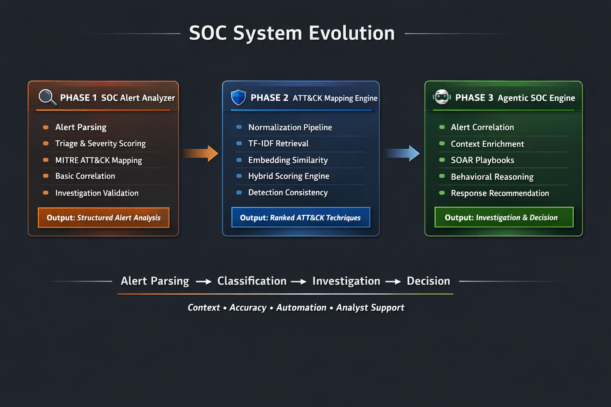

# 🛡️ AI Security Portfolio

A portfolio of cybersecurity projects demonstrating the evolution of a Security Operations Center (SOC) system from **alert analysis → detection engineering → agentic investigation**.

---

## 🧭 SOC System Evolution

<div align="center">
  
</div>

---

## 🎯 What This Portfolio Demonstrates

This portfolio shows how a SOC system can evolve across three key stages:

- **Alert Analysis** — understanding and triaging security events  
- **Detection Engineering** — mapping behavior to MITRE ATT&CK  
- **Investigation & Response** — correlating, enriching, and reasoning about threats  

Each project builds on the previous one to simulate increasingly realistic SOC capabilities.

---

## 🧬 Project Progression

---

### 🔍 Phase 1 — 🔗 [SOC Alert Analyzer](https://github.com/shannonasmith/AI-Assisted-SOC-Alert-Analyzer)  
**Focus:** alert parsing and triage  

Simulates how a SOC analyst processes raw alerts, assigns severity, and identifies suspicious activity.

**Key capabilities**
- alert parsing  
- severity scoring  
- MITRE ATT&CK mapping  
- response recommendations  
- investigation validation  

---

### 🛡️ Phase 2 — 🔗 [ATT&CK Mapping Engine](https://github.com/shannonasmith/AI-Assisted-SOC-MITRE-ATTACK-Mapping-Engine)  
**Focus:** classification and structured detection  

Expands into a detection engineering pipeline using retrieval and scoring techniques.

**Key capabilities**
- normalization pipeline  
- TF-IDF retrieval  
- embedding similarity  
- hybrid scoring engine  
- ATT&CK technique ranking  
- improved explainability  

---

### 🤖 Phase 3 — 🔗 [Agentic SOC Investigation Engine](https://github.com/shannonasmith/Agentic-SOC-Investigation-Engine)  
**Focus:** investigation, reasoning, and decision support  

Simulates a modern SOC workflow that enriches alerts, correlates activity, and recommends actions.

**Key capabilities**
- alert correlation  
- IOC enrichment  
- vulnerability context  
- asset context  
- SOAR playbooks  
- investigation loop  
- response recommendation
  
---

## 📈 Capability Progression

```text
Alert Parsing → Classification → Investigation → Decision
```

Each phase increases:

- context  
- accuracy  
- automation  
- analyst support  

---

## 🧠 Why This Matters

Modern SOCs are evolving toward:

- context-aware detection  
- automated investigation pipelines  
- explainable AI-assisted analysis  
- decision-support systems  

This portfolio reflects that evolution from foundational analysis to **agentic security operations**.

---

## 🛠️ Technologies Used

- Python  
- MITRE ATT&CK  
- TF-IDF / NLP  
- Sentence Transformers  
- Zeek  
- Splunk-style workflows  
- Rule-based detection  
- SOAR concepts  
- AI-assisted analysis  

---

## 🚀 Current Focus

Continuing to expand these systems toward:

- real-time ingestion  
- improved enrichment  
- stronger reasoning capabilities  
- reusable SOC automation workflows  

---

## 👤 Shannon Smith  

Cybersecurity | SOC Operations • Detection Engineering • Incident Response • AI-Assisted Security  
U.S. Navy Veteran | Virginia Tech — M.S. Information Technology
