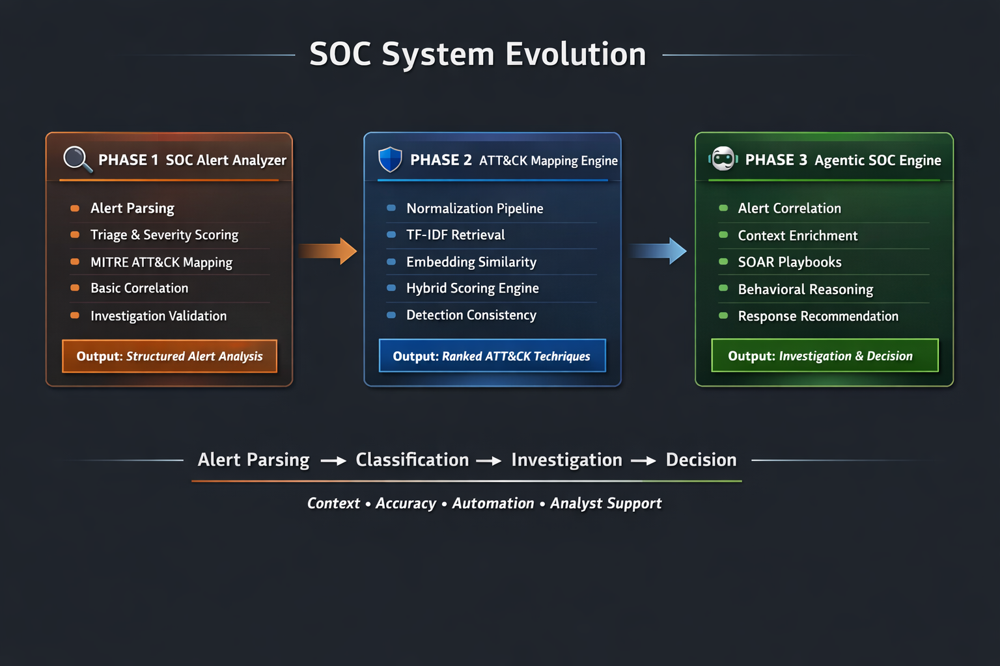

# 🛡️ AI Security Portfolio

## 🧠 SOC Systems • Detection Engineering • Agentic Investigation

  

<em>Progression from alert parsing → NLP-based ATT&CK classification → agentic investigation and decision support.</em>

---

## 🧠 What This Is

A three-phase SOC engineering system built from scratch in Python — starting with rule-based alert triage, progressing through an NLP-driven ATT&CK detection pipeline, and culminating in a stateful agentic investigation engine that enriches alerts with IOC data, CVE vulnerability context, and asset criticality before producing a final response recommendation.

Each phase is a working, runnable system. Each one builds directly on the last.

---

## 🧬 Project Progression

---

### 🔍 Phase 1 — [SOC Alert Analyzer](https://github.com/shannonasmith/AI-Assisted-SOC-Alert-Analyzer) 🔗

| Category | Details |
|----------|---------|
| Focus | Alert parsing and triage |
| Role | SOC analyst simulation |
| Output | Structured alert analysis with MITRE mapping and response recommendations |

**What it does:** Ingests JSON security alerts and runs each through a rule-based triage pipeline — severity scoring by attempt volume, MITRE ATT&CK mapping by event type (brute force → T1110, port scan → T1046), timeline reconstruction, and response recommendations tiered by severity. Optionally enriches output with a Gemini AI call. Produces a batch summary with severity breakdown, MITRE distribution, source IP correlation, and repeat offender detection across all alerts.

**Why it matters:** Establishes the alert understanding foundation and demonstrates that structured, auditable triage doesn't require AI — the rule-based layer runs fully without an API key and produces complete, explainable output.

---

### 🛡️ Phase 2 — [ATT&CK Mapping Engine](https://github.com/shannonasmith/AI-Assisted-SOC-MITRE-ATTACK-Mapping-Engine) 🔗

| Category | Details |
|----------|---------|
| Focus | Classification and structured detection |
| Role | Detection engineering pipeline |
| Output | Ranked ATT&CK techniques with per-component confidence scores |

**What it does:** Replaces Phase 1's keyword lookup with a full NLP classification pipeline. Zeek network logs (`conn.log`, `http.log`) and Splunk-style endpoint alerts are normalized by source-specific adapters into a consistent schema, then mapped to MITRE ATT&CK using three layered stages: TF-IDF candidate retrieval against the full Enterprise ATT&CK corpus, embedding-based reranking with `all-MiniLM-L6-v2` for semantic precision, and a hybrid scoring engine combining TF-IDF (30%), embedding (20%), and behavior-weighted rule scores (50%). Outputs per-alert ranked technique lists, a coverage summary, and an ATT&CK Navigator layer.

**Why it matters:** Demonstrates that accurate ATT&CK classification requires more than keyword matching — the retrieval-then-rerank architecture handles ambiguous and paraphrased alert descriptions while keeping scoring explainable and adjustable without retraining.

---

### 🤖 Phase 3 — [Agentic SOC Investigation Engine](https://github.com/shannonasmith/Agentic-SOC-Investigation-Engine) 🔗

| Category | Details |
|----------|---------|
| Focus | Investigation and decision support |
| Role | SOC analyst + automation system |
| Output | Investigation state, confidence trail, response recommendation, threat hunt findings |

**What it does:** Adds a full investigation and decision layer on top of Phase 2's detection pipeline. After ATT&CK mapping, the SOAR engine classifies incident type using tactic-weighted confidence scoring and selects a playbook (6 available: lateral movement, credential access, persistence, defense evasion, reconnaissance, collection). A stateful investigation agent then runs a `choose_next_action()` loop — accumulating confidence across IOC enrichment (+15%), CVE vulnerability lookup (+10%), asset criticality scoring (+5%), and cross-alert entity correlation (+5%) — and terminates early if confidence reaches ≥ 90%. A post-investigation threat hunting pass scans the full alert set for high-risk technique patterns, repeated source IPs, and critical CVE exposure.

**Why it matters:** This is the agentic piece — an agent that decides what to do next based on accumulated evidence, not a fixed execution sequence. A DC01 alert with Zerologon exposure and an external source IP reaches high confidence faster than a low-criticality workstation event, and the agent's behavior reflects that difference.

---

## 🧠 How the Three Phases Connect

| Phase | What It Adds | Key Technology |
|-------|-------------|----------------|
| Phase 1 | Rule-based triage, MITRE mapping, batch correlation | Python, Gemini API (optional) |
| Phase 2 | NLP-based ATT&CK classification from raw telemetry | TF-IDF, `sentence-transformers`, Zeek/Splunk adapters |
| Phase 3 | Stateful agentic investigation, SOAR, CVE/asset context, threat hunting | Confidence-accumulating agent loop, 6 SOAR playbooks |

The system is designed so each phase feeds the next: Phase 1 establishes the alert schema and triage logic. Phase 2 replaces the keyword MITRE lookup with a proper detection pipeline. Phase 3 wraps the detection output in an investigation layer that reasons about what the evidence means and what to do about it.

---

## 🛠️ Tech Stack

| Component | Detail |
|-----------|--------|
| Language | Python 3 |
| ATT&CK Retrieval | `scikit-learn` TF-IDF (bigrams, L2-normalized) |
| Semantic Reranking | `sentence-transformers` (`all-MiniLM-L6-v2`) |
| ATT&CK Data | MITRE CTI Enterprise ATT&CK JSON |
| Log Sources | Zeek `conn.log` / `http.log`, Splunk JSON |
| AI Enrichment | Google Gemini API (Phase 1, optional) |
| SOAR | Custom playbook engine, 6 incident categories |
| Investigation Agent | Stateful confidence-accumulating loop |
| Vulnerability Data | CVE database with CVSS scores and exploit flags |

---

## 🧠 SOC Workflow Alignment

| SOC Stage | System Capability |
|-----------|------------------|
| Alert Generation | Zeek network logs, Splunk-style endpoint alerts |
| Triage | Severity scoring and keyword-based triage (Phase 1) |
| Detection | Hybrid NLP ATT&CK classification pipeline (Phase 2) |
| Correlation | Cross-alert entity correlation by IP and username (Phase 3) |
| Investigation | IOC enrichment, CVE context, asset criticality (Phase 3) |
| Response | SOAR playbook selection, agentic decision support (Phase 3) |
| Threat Hunting | Post-investigation cross-alert anomaly detection (Phase 3) |

---

## 🚀 Current Direction

- real-time streaming ingestion pipeline
- live threat intelligence feed integration for IOC enrichment
- SIEM/XDR API integration (Splunk, Elastic, CrowdStrike)
- LLM integration for the analyst reasoning layer

---

## 👤 Shannon Smith

Cybersecurity | SOC Operations • Detection Engineering • Incident Response • AI-Assisted Security

